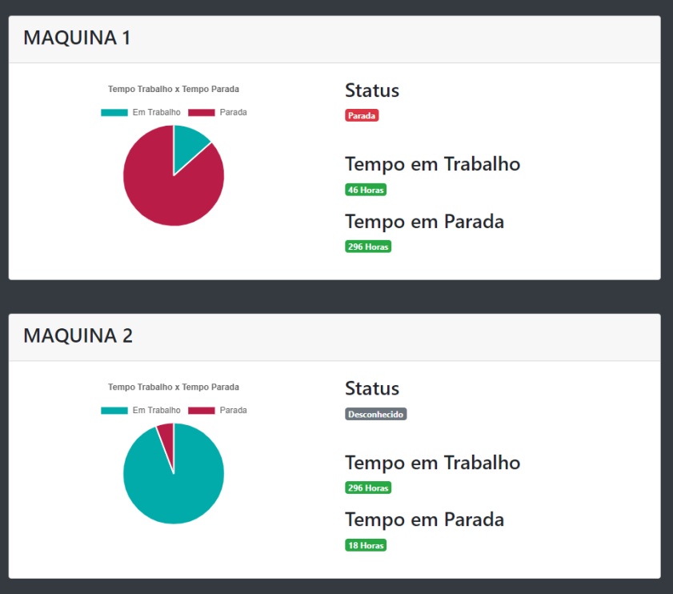

# TCC - Telemetria Industrial

Com a Indústria 4.0, ou 4° revolução industrial, muitos paradigmas da indústria estão
sendo alterados, no entanto, para que ela se concretize, os maquinários das indústrias
devem estar de acordo com esse novo modelo, possibilitando principalmente a coleta de
informações em tempo real, auxiliando os gestores na tomada de decisões produtivas. No
entanto, nem todas as máquinas da indústria são capazes de enviar suas informações de
operação em tempo real e a troca de todos os equipamentos do parque industrial é inviável
financeiramente, visto que o custo para essa troca seria elevado demais para a maioria
das empresas. Desta forma, um dos caminhos possíveis é a atualização das máquinas já
existentes, adicionando novas funcionalidades através de módulos, permitindo que elas se
integrem no modelo da indústria 4.0. O presente trabalho apresenta uma ferramenta que
pode ser acoplada a aparelhos legados, permitindo a coleta e disponibilização de dados
operacionais. Para verificar a validade da proposta, realizamos um exemplo de aplicação
com uma máquina de usinagem de eletroerosão a fio, modelo Agie Charmilles CUT 30 P.
Os resultados trazem indícios de que nossa solução viabiliza a adaptação de maquinários
antigos para os novos desafios da quarta revolução industrial.

## Screenshots

